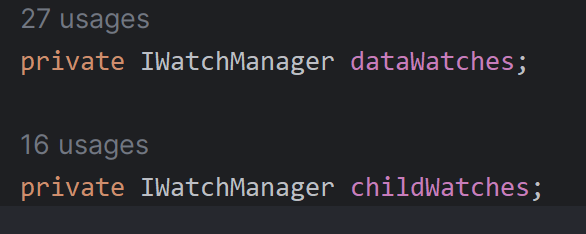
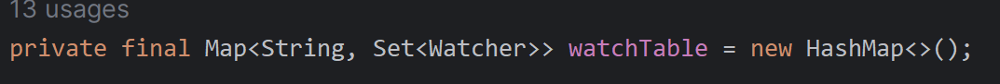
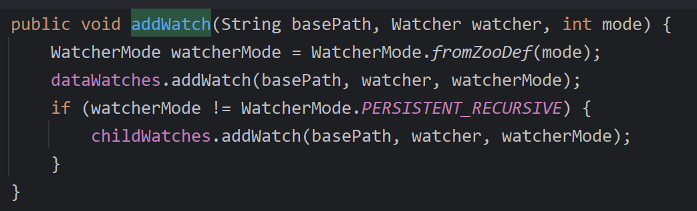
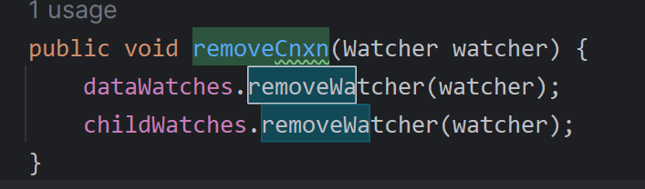
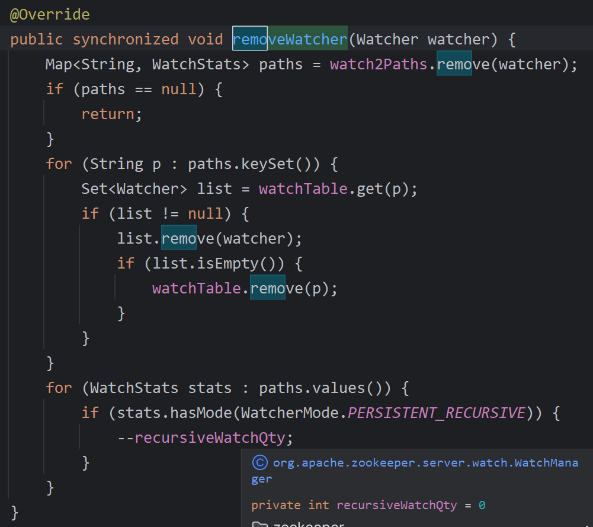
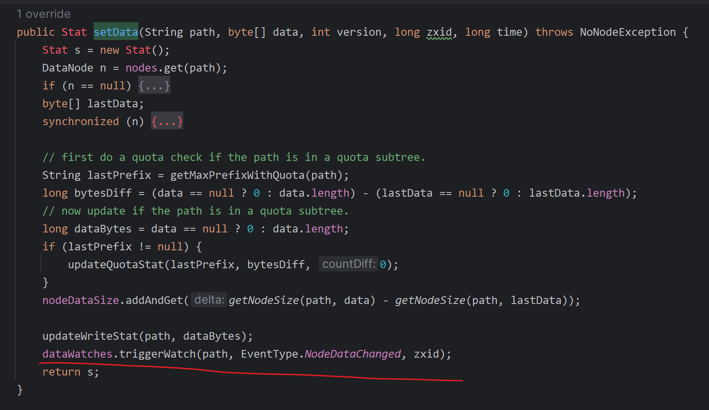

DataTree类

有俩成员变量



这个接口的实现类是


该实现类有成员变量



这个里面装的就是各个观察者

---


**注册**

`org.apache.zookeeper.server.DataTree#addWatch` 函数



调用到

`org.apache.zookeeper.server.watch.WatchManager#addWatch(java.lang.String, org.apache.zookeeper.Watcher, org.apache.zookeeper.server.watch.WatcherMode)`

该函数讲监听器注册加入


**删除**

`org.apache.zookeeper.server.DataTree#removeCnxn`



调用

`org.apache.zookeeper.server.watch.WatchManager#removeWatcher(org.apache.zookeeper.Watcher)`



删除注销监听器

---


触发广播

`org.apache.zookeeper.server.DataTree#deleteNode` 删除节点时的触发

`org.apache.zookeeper.server.DataTree#createNode(java.lang.String, byte[], java.util.List<ACL>, long, int, long, long, Stat)` 增加节点时的触发

下面只对状态改变时进行说明，增加删除同理

`org.apache.zookeeper.server.DataTree#setData`



调用

`org.apache.zookeeper.server.watch.WatchManager#triggerWatch(java.lang.String, org.apache.zookeeper.Watcher.Event.EventType, long, org.apache.zookeeper.server.watch.WatcherOrBitSet)`

```java

    @Override
    public WatcherOrBitSet triggerWatch(String path, EventType type, long zxid, WatcherOrBitSet supress) {
        // 这里就是监听到的事件
        WatchedEvent e = new WatchedEvent(type, KeeperState.SyncConnected, path, zxid);
        // 这玩意拿来存放监听器
        Set<Watcher> watchers = new HashSet<>();
        // 加个锁保证线程安全
        synchronized (this) {
            PathParentIterator pathParentIterator = getPathParentIterator(path);
            for (String localPath : pathParentIterator.asIterable()) {
                // 这里根据 path 节点路径来获取到当前节点的监听器
                Set<Watcher> thisWatchers = watchTable.get(localPath);
                if (thisWatchers == null || thisWatchers.isEmpty()) {
                    continue;
                }
                // 下面开始遍历取监听器
                Iterator<Watcher> iterator = thisWatchers.iterator();
                while (iterator.hasNext()) {
                    Watcher watcher = iterator.next();
                    Map<String, WatchStats> paths = watch2Paths.getOrDefault(watcher, Collections.emptyMap());
                    WatchStats stats = paths.get(localPath);
                    if (stats == null) {
                        LOG.warn("inconsistent watch table for watcher {}, {} not in path list", watcher, localPath);
                        continue;
                    }
                    // 这里把取到的监听器放到 watchers 里面，后面拿来遍历 
                    if (!pathParentIterator.atParentPath()) {
                        watchers.add(watcher); // 增加
                        WatchStats newStats = stats.removeMode(WatcherMode.STANDARD);
                        if (newStats == WatchStats.NONE) {
                            iterator.remove();
                            paths.remove(localPath);
                        } else if (newStats != stats) {
                            paths.put(localPath, newStats);
                        }
                    } else if (stats.hasMode(WatcherMode.PERSISTENT_RECURSIVE)) {
                        watchers.add(watcher); // 增加
                    }
                }
                if (thisWatchers.isEmpty()) {
                    watchTable.remove(localPath); // 监听器都没，说明死了，删掉
                }
            }
        }
        if (watchers.isEmpty()) {
            if (LOG.isTraceEnabled()) {
                ZooTrace.logTraceMessage(LOG, ZooTrace.EVENT_DELIVERY_TRACE_MASK, "No watchers for " + path);
            }
            return null;
        }
		
        // 这里遍历这个集合
        for (Watcher w : watchers) {
            if (supress != null && supress.contains(w)) {
                continue;
            }
            // 该函数即为触发调用监听器自己的方法执行 即为 通知各个监听器
            w.process(e);
        }

        switch (type) {
            case NodeCreated:
                ServerMetrics.getMetrics().NODE_CREATED_WATCHER.add(watchers.size());
                break;

            case NodeDeleted:
                ServerMetrics.getMetrics().NODE_DELETED_WATCHER.add(watchers.size());
                break;

            case NodeDataChanged:
                ServerMetrics.getMetrics().NODE_CHANGED_WATCHER.add(watchers.size());
                break;

            case NodeChildrenChanged:
                ServerMetrics.getMetrics().NODE_CHILDREN_WATCHER.add(watchers.size());
                break;
            default:
                // Other types not logged.
                break;
        }

        return new WatcherOrBitSet(watchers);
    }
  
```

